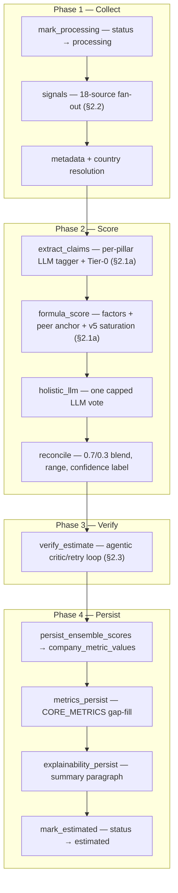
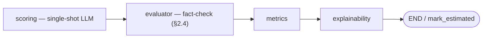
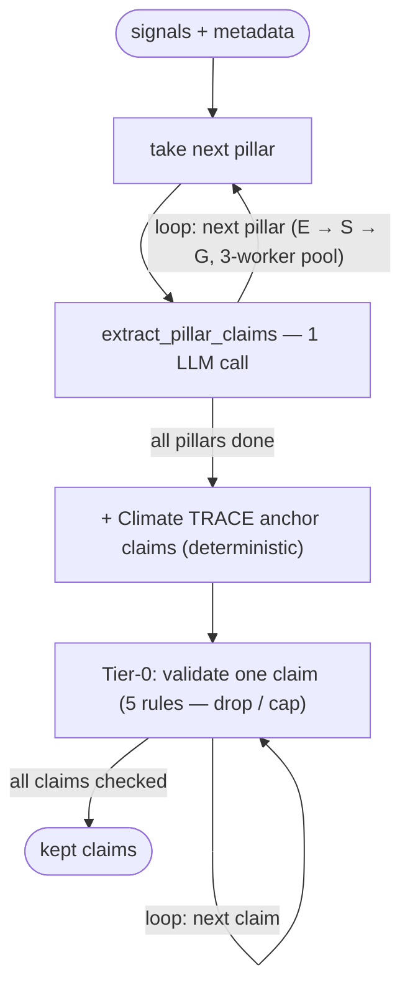
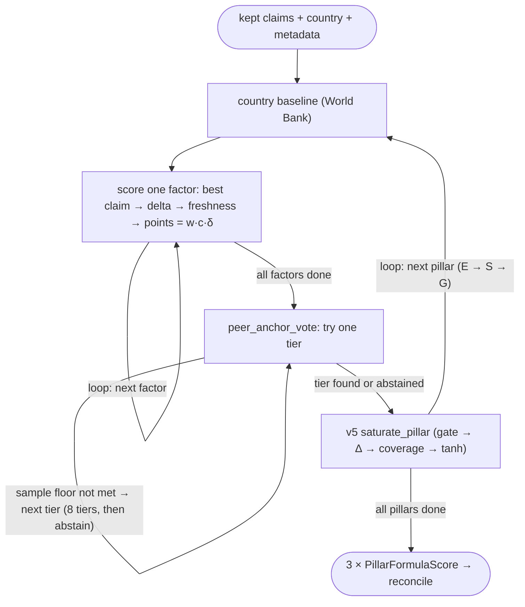
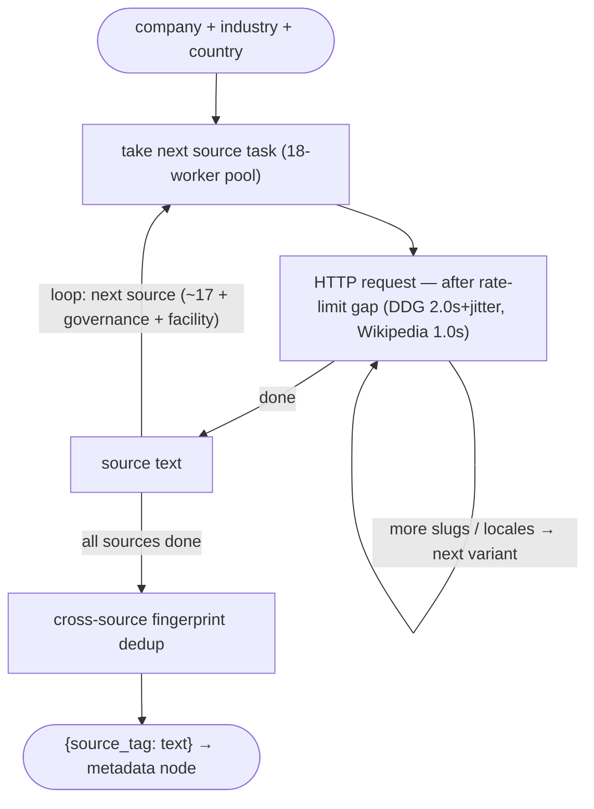
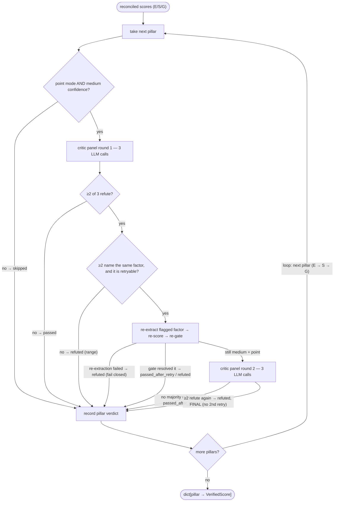
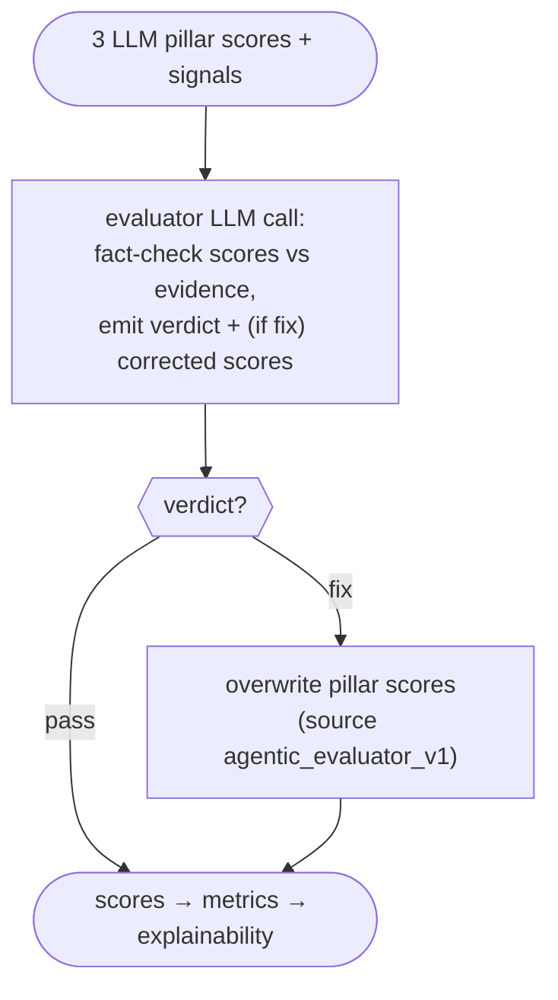

# ESG Agentic Pipeline — Complete Reference

Authoritative, file-by-file, formula-by-formula documentation of the ESG estimation
pipeline: what each file does, every formula and weight and where it came from,
every assumption, every external data source. Written for both human and AI readers.

---

## 1. Executive overview

**Purpose:** estimate E/S/G pillar scores (0–100) for companies that have no
disclosed ESG data, using free public data sources plus a deterministic formula
as the primary scorer.

**Design philosophy:**
- The LLM is used as an **evidence tagger** (extract typed claims from text
  against a closed factor registry) and as **one capped vote** in an ensemble —
  it is **never allowed to emit the final 0–100 score directly** on the
  production path.
- The deterministic **formula estimator + v5 saturation** is the primary
  scorer; a single **holistic LLM vote** is blended in afterward at a fixed,
  bounded weight, then reconciled into one score with an honest uncertainty
  range.
- Every constant/weight in the pipeline is documented as either **hand-set**
  (a starting point, not fitted), **grid-tuned + held-out validated** (only 2
  values in the whole pipeline: saturation's S-pillar `a=35`, and reconcile's
  flat 0.7/0.3 blend), or **measured live** against a real failure. Full
  Phase-5 regression against ground truth is still pending — see §13.

**Four-layer architecture:**

| Layer | Role | Key files |
|---|---|---|
| **Layer 1** | Evidence collection (news, governance, facility, metadata, country baselines, peer tables) | `agentic_estimation/layer_1/*.py` |
| **Layer 2** | Claim extraction + validation (LLM tagger, deterministic anchors, Tier-0 rules) | `agentic_estimation/layer_2/*.py` |
| **Layer 3** | Scoring (formula, saturation, peer anchor, holistic vote, reconciliation, gate) | `agentic_estimation/layer_3/*.py` |
| **Layer 4** | Verification (critic panel, retry) + explainability | `agentic_estimation/layer_4/*.py` |

**Where the agentic looping actually lives:** the rest of the pipeline is a
single deterministic pass — no loops. The one exception is Layer 4's
`estimate_verifier.verify_reconciled()`, which runs a bounded critic-panel /
re-extraction retry loop (max 1 retry, max 2 panel rounds, per pillar) as
plain Python control flow *inside* the graph's single `verify_estimate` node
— see §2.3 for the full flowchart. It is invisible in the top-level LangGraph
diagram (§2.1) because LangGraph never sees it as separate nodes/edges.

**Entry point:** `POST /esg/market-esg` → background task → LangGraph
`run_company_graph(..., scorer="ensemble")` → DB persistence → frontend polls
`POST /esg/estimation-status`. Full chain in §7.4.

---

## 2. Pipeline diagrams

### 2.1 Full orchestration graph (`agentic_estimation/graph.py`)

One compiled LangGraph serves three scorer paths (`llm` legacy, `formula`
isolation-only, `ensemble` production), routed by the `scorer` state field, and
a `dry_run` flag that routes around every DB-persisting node.

**Read this first — the two levels of the pipeline.** The outer LangGraph is an
acyclic DAG: its own edges never cycle. The pipeline's loops all live **inside**
individual nodes as plain Python iteration/retry, drawn in §2.1a–§2.3 with real
back-edges. To keep the diagrams readable, the main diagram below shows only the
**production ensemble full-run path** (the case that matters); the dry-run /
formula-only / legacy-llm variants are routing decisions, and conditions read
better as a table than as crossing edges — they follow underneath.



**Routing variants** (conditional edges in `build_graph()` — these are what the
diagram above deliberately omits):

| From | Condition | Goes to |
|---|---|---|
| entry | full run | `mark_processing` |
| entry | dry run | `signals` (all status/DB writes skipped) |
| `metadata` | `scorer=llm` | legacy scoring path (below) |
| `metadata` | `scorer=formula/ensemble` | `extract_claims` (`_persist` full / `_dry`) |
| `formula_score` | `scorer=formula` | END (dry) or `mark_estimated` (full) — no holistic/reconcile |
| `formula_score` | `scorer=ensemble` | `holistic_llm` |
| `verify_estimate` | dry run | END (nothing persisted) |
| `verify_estimate` | full run | `persist_ensemble_scores` |

**Legacy `scorer=llm` path** (calibration baseline only, not production):



`mark_processing`, `extract_claims_persist`, `persist_ensemble_scores`,
`metrics_persist`, `explainability_persist`, `mark_estimated` are `async`
(DB-persisting). **Invariant** (documented on `run_company_dry_graph`): the sync
`graph.invoke()` dry path can never reach an async node — the entry point and
`_route_after_metadata` route strictly on `not dry_run`. `run_company_graph`
(async) is the sole writer of status `"failed"` (wraps `graph.ainvoke`, catches
any exception, sets `"failed"`, re-raises; also on a final-state `error` key);
`node_mark_estimated` is the sole writer of `"estimated"`.

### 2.1a Node-internal loops: `extract_claims` and `formula_score`

**`extract_claims` internals** — one LLM extraction per pillar (concurrent),
then a validation pass over every claim:



**`formula_score` internals** — three nested loops: per pillar, per factor,
per peer-anchor tier:



### 2.2 The `signals` node internals — source fan-out + per-request retry loops



The `REQ` self-edges are the 429-retry loop (bounded to 1 retry per request via
`range(2)`) and the slug/locale iteration (Wikipedia tries 5 title-suffix
variants; Google News iterates locales); `TEXT → POOL` is the source-pool
fan-out. The three collectors feeding scoring directly (not part of the signals
pool) — `company_metadata`, `country_baseline_agent`, `peer_anchor_collector` —
appear in §2.1a (`peer_anchor` is the tier back-edge there).

### 2.3 The agentic loop — inside `verify_estimate` / `estimate_verifier.verify_reconciled()`

This is the pipeline's one genuinely agentic (iterate-and-revise) loop: a
critic panel that can trigger a re-extraction and re-score, then re-judge. It
runs **independently per pillar** (`loop: next pillar` back-edge below), and
the `RETRY → RESCORE → CHECK4 → PANEL2` path plus the retry itself are the
revise-and-recheck cycle. Bounded to **1 retry, 2 panel rounds, ≤6 LLM calls
per pillar**.



Every branch carries its verdict on the edge label and lands in one `record`
sink — the **only** back-edge is `more pillars → take next pillar`. There is
deliberately no `round 2 → round 1` edge and no second retry edge: a second
refute is terminal by design (`_MAX_RETRIES=1`, `_MAX_PANEL_ROUNDS=2`), which
is why this is a bounded agentic loop, not an open-ended one. The node also
never raises — any exception at any step degrades to the original gate output
(`verdict="skipped"`).

### 2.4 The legacy `llm`-path loop — `evaluator`

On the legacy `scorer="llm"` path only, `evaluator` fact-checks the three LLM
pillar scores against the raw evidence. Note this is **not** a true iterate
loop — the corrected scores come back in the *same* LLM call as the verdict
(one round, no second call), so it's shown as a branch, not a back-edge:



(Documented as "at most ONE correction round" — the fix is single-shot.)

---

## 3. Layer 1 — Evidence collection

### 3.1 `signal_agent.py`
Primary evidence gatherer: `fetch_company_signals(company, industry="", country=None) -> dict[source→text]`
runs ~17 source tasks in an 18-worker pool. `get_or_fetch_signals` is the DB-cached
wrapper (table `company_esg_signals`, PK `(company_id, source)`, **no TTL**).

Sources: NewsAPI (`newsapi.org/v2/everything`, 100 req/day free), Google News RSS
(general + site-restricted Reuters/Bloomberg/FT/ESGToday/GreenBiz + localized
locales via `country_esg_keywords.py`), DuckDuckGo (via `ddgs`, shared rate limiter),
Wikipedia REST summary, plus site-restricted DDG searches for BHRRC, SBTi, CDP, GRI.

Key constants: `_DDG_LIMITER` min_gap=2.0s+1.5s jitter ("keeps us well under DDG's
~1 req/s soft limit," live-observed); `_WIKIPEDIA_LIMITER` min_gap=1.0s; NewsAPI
`when_days=365` default window; DDG retry backoff `8+uniform(0,4)`s, 1 retry only;
content truncation caps 200–1500 chars per source. Filler-result guard drops
Google-News homepage listings (`"home - "` + `≥2` dashes, found live on ft.com).
Cross-source fingerprint dedup on headline feeds (`evidence_filters._fingerprint`).

**Blind spots (documented):** no TTL on the signal cache; a cache-hit company
won't retroactively get a localized query if `country` is added later; batch path
(`fetch_signals_for_companies`) doesn't forward `country` at all; NewsAPI requires
literal company-name match in title/description.

### 3.2 `governance_collector.py`
Adds governance-specific evidence — docstring states this gap caused "G's flat
~45-55 predictions" before this file existed. Tier-1 structured: SEC DEF 14A
independent-director search, SEC 10-K Item 3 Legal Proceedings, Wikidata board
count. Tier-2: DDG web search for board/fines/compliance/litigation (fixed
query strings embedding "2023 2024 2025", `min_len=60, reject_wikipedia=True`).

**Documented precision issue:** DDG can return real-but-irrelevant text that
passes the length/wikipedia guards — cited live example: a "Blackmores" board
query returned genuine content about yoga poses. Layer-2 must not treat "has a
source" as confidence>0. Litigation Item-3 text is often just a cross-reference
to financial-statement notes ("Please see Note 12…", live Nvidia example);
following the reference is deliberately out of scope.

### 3.3 `facility_extractor.py`
Gathers factory/facility count and location TEXT (not parsed numbers) — "no
reliable structured API" for this exists. Priority: SEC 10-K Item 2 Properties,
then always ALSO a DDG web fallback (both run, not either/or) since a company may
have both a 10-K summary and separate sustainability-report detail. SEC path is
US-listed-only; web fallback is lower reliability by design, "should reflect
that downstream (Layer 2)."

### 3.4 `company_metadata.py`
Resolves employees/revenue/assets/industry/country/HQ/LEI/CIK/board-size via a
fixed fallback chain: **Wikidata → GLEIF → OpenStreetMap → name inference**
(+ small curated brand-alias table, e.g. Zara/Bershka/Pull&Bear/Massimo Dutti →
"Inditex"). DB-cached (`company_metadata` table, PK `company_id`) plus
in-process `lru_cache` on every lookup function.

**`_CURRENCY_TO_USD` static FX table** (hand-set, explicitly NOT live-updated —
"a live FX API would add a network dependency… approximate but far better than
treating every non-USD figure as USD, a real ~10-40%+ error"): USD 1.0, EUR
1.08, GBP 1.27, JPY 0.0067, CHF 1.13, CAD 0.73, AUD 0.65, CNY/RMB 0.14, KRW
0.00072, INR 0.012, SEK 0.094, NOK 0.091, DKK 0.145, HKD 0.128. An unlabeled
quantity is treated as already-USD; a *labeled* currency not in this table
returns **None** rather than a silently wrong number.

**Wikidata QID guard:** requires name-overlap ≥0.6 before accepting a search
hit (fix for a prior bug that accepted `hits[0]` unconditionally with no name
check). `classify_manufacturing_vs_services` is a deterministic keyword-based
Tier-1 classification ("NOT an LLM guess… must be auditable"), confidences
0.8 (clear match) / 0.5 (mixed) / 0.0 (unknown).

### 3.5 `country_baseline_agent.py`
Reads the World Bank ESG Excel dataset (`raw_esg_data/esgdata_download-2026-05-01.xlsx`),
computes per-country E/S/G baselines, persists to `country_esg_baseline`
(cached in-process after first load, DB-backed).

**Method:** 34 E-indicators / 23 S-indicators / 17 G-indicators, each hand-annotated
`+1`/`-1` for direction (e.g. PM2.5 pollution = `-1`, lower is better). Each
indicator is **min-max normalized to 0–100** across all countries (flat 50.0 if
no variance); pillar score = **unweighted mean** of its normalized indicators,
requiring at least half the indicators present or the pillar is NaN → defaults
to 50.0. Year = median of per-indicator latest non-null years (default 2020).

`_COUNTRY_ALIASES` (hand-verified colloquial→WB Economy name, e.g. "south korea"
→"Korea, Rep.", "turkey"→"Turkiye", "czech republic"→"Czechia") and a tiny
`_REGIONAL_FALLBACK` (4 real constitutional-fact cases: Isle of Man/Channel
Islands→UK, Sint Maarten→Netherlands, St. Martin→France) sit in front of a
genuine cross-country mean as the final fallback. Country identity matching is
**exact only, never fuzzy** — "Iran and Iraq are NOT 80% the same country."

### 3.6 `peer_anchor_collector.py`
Pure SQL, no LLM. Finds comparable companies from `bcorp_lookup` (10,337 rows),
`upright_lookup` (10,086 rows), and real (non-agentic-sourced)
`company_metric_values` rows. `_MIN_PEERS_FOR_SECTOR_COUNTRY = 5`,
`_MIN_PEERS_FOR_SECTOR_ONLY = 5`. Ground-truth leakage guarded twice: SQL
`!= %s` pre-filter plus a normalized `_drop_self` post-filter.

**Documented limitation:** bcorp's `sasb_sector`/`industry_category` and
upright's `industry` are different vocabularies with no shared taxonomy by
`=` comparison — this is exactly what `country_crosswalk.py` and
`sector_crosswalk.py`/`sector_matcher.py` (below) exist to bridge.

### 3.7 `country_crosswalk.py`
Converts a resolved country string into each peer source's own spelling.
`country_for_bcorp()` — 88/103 bcorp countries already match WB Economy names
as-is; a small hand-confirmed table covers the rest (Czechia→Czech Republic,
Croatia→"Croatia (Hrvatska)", Netherlands→"Netherlands The", Hong Kong SAR→
"Hong Kong S.A.R.", etc.) plus raw-string territories (Jersey, Puerto Rico).
`country_for_upright()` — converts to ISO3 (95/101 match WB ISO3 exactly);
`_UPRIGHT_NO_WB_TERRITORY` covers Guernsey/Jersey/Hong Kong/Macau/Taiwan, which
have no WB row at all. Before this fix, every upright country+sector peer
lookup was silently unreachable (vocabulary mismatch).

### 3.8 `sector_crosswalk.py`
Static, hand-built exact map: all 30 upright `industry` labels → bcorp's 22
`industry_category` values (many-to-one, e.g. Aerospace/Automotive/Chemicals/
Electronics/Food and Beverage → "Manufactured Goods"). "Built by reading both
label sets side by side… exact and auditable," not string similarity. Reverse
index built once at import so the two directions can't drift apart. This is
the **first, higher-confidence tier** peer_anchor tries before fuzzy matching.

### 3.9 `sector_matcher.py`
Fuzzy fallback for free-text sectors that don't hit the exact crosswalk: a
pure-numpy/stdlib TF-IDF cosine similarity (no sklearn — not installed).
`_MIN_SIMILARITY = 0.30` floor below which the match is rejected (caller falls
back further). Small curated stemming (`_STEM_ALIASES`: automotive/auto/cars/
car → "auto") and a stopword list that deliberately includes "manufacturing"
(found live to dominate scores otherwise). **Explicitly not semantic** — won't
catch pure synonyms with zero shared tokens; documented as a real limitation,
not hidden.

### 3.10 `upright_pillar_proxy.py`
Upright only has one overall `net_impact_ratio_percentile`, no per-pillar
score. This derives honest E/S proxies (method tags `upright_proxy_e`/`_s`) by
percentile-ranking each raw sub-component (10 E columns, 15 S columns,
`_negative` columns inverted `100-pct`) within the upright distribution, then
**plain-averaging** — "not weighted, since we have no principled basis to
weight e.g. e1_ghg over e4_biodiversity." **No G proxy exists by design**
(Upright's k1–k4 are human-capital/knowledge, not governance) — raises
`ValueError` rather than silently abstaining for G. Two process-wide in-memory
caches (distribution, all-company-values), no invalidation.

### 3.11 `sec_filings.py`
Shared SEC EDGAR access (CIK resolution, 10-K/DEF 14A fetch, section
extraction) reused by governance_collector and facility_extractor. Always
returns the **last** occurrence of a heading (verified live against Nvidia's
FY2026 10-K — the first occurrence is the table-of-contents reference, not
real prose). No CIK / no 10-K / section-not-found are all expected outcomes
(non-US-listed company), not errors.

### 3.12 `country_esg_keywords.py`
19-market native-language ESG keyword profiles + Google News locale routing
(Germany's CSRD/Lieferkettengesetz, India's BRSR, Brazil's ASG, Japan's GX経済移行債,
etc.). Unmapped countries fall back to English-only — never guesses a locale.

### 3.13 `evidence_filters.py`
Pre-LLM hygiene: sha256 fingerprint dedup of duplicate headlines + a flat ESG
keyword-relevance gate (`_ESG_RELEVANCE_TERMS`), fails open (never returns
empty). Explicitly **not** a substitute for the LLM's semantic check — "won't
catch the yoga-page bleed-through."

### 3.14 `climate_trace_harvester.py`
Batch ETL (not a live per-request component) against the public no-key Climate
TRACE v7 API. Enumerates owners a–z (no "list all" endpoint exists), harvests
per-owner facility emissions and per-country sector/subsector totals into three
tables (`climate_trace_owners` ~14,500 rows, `climate_trace_owner_emissions`,
`climate_trace_country_emissions`). `_MIN_GAP = 1.0s` polite pacing — this is
the precedent `zen_client.py`'s own rate limiter cites. Idempotent upserts;
connections held open only during write windows (Neon idle-close avoidance).

### 3.15 `market_climate_trace_mapper.py`
One-time batch LLM classification of each market name → a real (sector,
subsector) pair from Climate TRACE, so a market can borrow that process's real
emissions intensity. Closed-set: the LLM must pick from the actual DB-derived
pair list (64 pairs) or answer `no_match`; any hallucinated pair is rejected
and forced to `no_match` confidence 0.0. A hand-built `_NO_MATCH_KEYWORDS`
list (~55 terms) pre-filters obviously non-physical markets (pharma, software,
financial services) before spending an LLM call. `max_tokens=600` — raised
live from 300 after observing truncated responses under real load.

### 3.16 `run_signals.py`
Standalone CLI/demo tool to fetch and pretty-print signals for a market's key
players. Not imported by the pipeline; developer inspection only.

---

## 4. Layer 2 — Claim extraction & validation

### 4.1 `factor_registry.py` — the closed factor set (source of truth)

Every scorable factor carries a **hand-set starting weight** (docstring: "pillar-score
points of swing at confidence=1, |delta|=1… documented starting points, not
fitted; Phase 5 regresses them against ground truth"), chosen so a
fully-evidenced pillar can swing roughly ±30 points around the country baseline.

| Factor key | Pillar | Weight | Shape | Direction |
|---|---|---|---|---|
| scope_1_emissions | E | 8 | benchmark_band | lower |
| scope_2_emissions | E | 8 | benchmark_band | lower |
| scope_3_emissions | E | 8 | benchmark_band | lower |
| renewable_energy_pct | E | 6 | benchmark_band | higher |
| total_energy_consumption | E | 5 | benchmark_band | lower |
| water_withdrawal | E | 5 | benchmark_band | lower |
| total_waste_generated | E | 5 | benchmark_band | lower |
| net_zero_pledge | E | 5 | event | higher |
| sbti_commitment | E | 6 | event | higher |
| cdp_disclosure | E | 4 | event | higher |
| environmental_controversy | E | 10 | event | lower |
| sector_emissions_intensity | E | 4 | event | lower |
| female_employees_pct | S | 5 | benchmark_band | higher |
| female_board_pct | S | 6 | benchmark_band | higher |
| employee_turnover_rate | S | 4 | benchmark_band | lower |
| lost_time_injury_rate | S | 6 | benchmark_band | lower |
| labor_controversy | S | 10 | event | lower |
| human_rights_incident | S | 12 | event | lower |
| workplace_safety | S | 6 | event | higher |
| board_independence_pct | G | 8 | benchmark_band | higher |
| anti_corruption_policy | G | 5 | event* | higher |
| whistleblower_mechanism | G | 4 | event* | higher |
| esg_report_published | G | 4 | event* | higher |
| third_party_esg_audit | G | 5 | event* | higher |
| regulatory_fines | G | 9 | event | lower |
| litigation | G | 7 | event | lower |
| compliance_certification | G | 5 | event | higher |
| governance_controversy | G | 8 | event | lower |

\*These four Governance booleans are CORE_METRICS-backed but have `benchmark=None`,
so the shape-assignment rule (`"benchmark_band" if metric["benchmark"] else "event"`)
actually resolves them to `event` shape despite being CORE-sourced.

**Registry weight sums** (coverage denominator in saturation): **E=74, S=49, G=55**.

Guards: unknown factor for a scored CORE metric → `ValueError`; duplicate key
between CORE and hand-authored event factors → `ValueError`.

### 4.2 `pillar_extractors.py`
One LLM call **per pillar** (3 per company, concurrent, `ThreadPoolExecutor(max_workers=3)`).
The model is an **evidence tagger, never a scorer** — emits `ExtractedClaim`s
against the closed factor set, citing which signal each came from.
`extract_all_claims(company, signals, metadata) -> list[ExtractedClaim]`.

Per-signal truncation 1500 chars, total signals block capped 12000 chars.
`max_tokens=2500`. Parse-failure fallbacks: `strength=0.5`, `confidence=0.4`,
`polarity=0`. Unit coercion table for numeric claims (`kt=1000`, `mt=1_000_000`,
`twh=3_600_000`, `gwh=3600`, `mwh=3.6`, `kwh=0.0036`; unmatched unit → value
dropped). Code-level guards drop claims for unknown factors, cross-pillar
mismatches, or a cited `source_tag` that wasn't actually in the shown signals
(hallucinated-source guard).

### 4.3 `climate_trace_anchor.py`
Deterministic (no LLM), fails closed to `[]`. Two additive claim sources:

1. **Owner-name match** → real summed facility emissions. Confidence **0.85**,
   `polarity=0` (magnitude-only). Matching is deliberately conservative —
   exact-match after suffix-stripping only, **no fuzzy matching** ("against
   14,513 owners a fuzzy threshold would eventually assert the wrong
   company's real emissions at 0.85").
2. **Sector anchor** → country×sector emissions percentile vs other sectors in
   that country. Confidence **0.25**, `polarity=-1` (higher emissions = worse),
   `strength=percentile`. Formula: `percentile = rank / (n_sectors - 1)`,
   sectors sorted ascending by emissions (0=cleanest, 1=dirtiest); needs ≥3
   sectors to rank. Only uses market-mapper rows with `confidence >= 0.6`.

Only harvested year: `2024`.

### 4.4 `claim_validators.py` — Tier-0 deterministic validators

Pure code, no LLM, one read-only DB lookup. Runs AFTER extraction/anchoring,
BEFORE formula scoring. Five rules — only **drop** or **cap confidence**, never
fabricate. Motivated by live failures (docstring cites "yoga-page,"
"Hawaiian restaurant," "Melissa Wyatt" wrong-entity extractions).

| Rule | Action | Exact effect |
|---|---|---|
| (a) Lexical relevance | DROP | cited signal text contains none of the factor's topic terms (fallback: pillar-level terms) → drop. Exempt: `dataset_lookup`/`peer_ratio_fallback`/`coarse_bucket` methods. |
| (b) Numeric bounds | CAP | non-finite or negative value → null it; `_pct` factor outside [0,100] → null; `scope_1_emissions` exceeding the country's harvested Climate TRACE total → confidence capped to **0.3**. |
| (c) Polarity consistency | CAP | factor in `{environmental_controversy, labor_controversy, human_rights_incident, regulatory_fines, litigation, governance_controversy}` with `polarity==1` (backwards) → confidence **×0.5**. |
| (d) Corroboration | CAP | for factors weight ≥**9.0**, negative claims sharing exactly ONE distinct `source_tag` (counts distinct sources, not claim objects) → confidence **×0.7** on all of them. |
| (e) Known-failure shape | CAP | confidence >**0.7** but cited text <**200** chars → confidence capped to **0.5**. |

### 4.5 `evidence_freshness.py`
Exponential recency decay, applied only to **event-shaped, extracted-method**
claims (never to disclosed benchmark data — "ESG disclosure is annual").

```
decay(days) = max(0.5, exp(-days / 365))     # days clamped >= 0
```
`_HALF_LIFE_DAYS=365` (an e-folding constant, not a literal half-life — set
well above a source-pipeline's 30-day sales-tuned constant since ESG evidence
decays slower). `_FRESHNESS_FLOOR=0.5` (old evidence still counts, never zero).
Undated signals get a flat **0.6** penalty (deliberately between the floor and
1.0 — undated ESG evidence should be penalized, unlike some reference
pipelines that treat undated as freshest).

### 4.6 `ratio_estimator.py`
Deterministic (no LLM) Tier-3 peer-median backfill for factors Layer 1 missed
entirely (common for small/private companies). Ordered fallback, confidence
strictly decreasing:

| Tier | Method | Confidence | Sample floor |
|---|---|---|---|
| 1 | sector+country peer median | **0.3** | 3 (bcorp/upright) or 15 (real metric — a noisy 5-row sample medianed badly live) |
| 2 | sector-only peer median | **0.2** | same floor |
| 3 | coarse size bucket | **0.15** | ≥1 |
| 4 | absent | **0.0** | — no claim written |

Honestly documents that `employee_count`/`annual_revenue`/most factory fields
realistically resolve to ABSENT given real data sparsity — not fabricated.

---

## 5. Layer 3 — Scoring

### 5.1 `metric_estimation_agent.py` — CORE_METRICS backbone
Owns the benchmark bands `factor_registry` imports. Format `(value_for_100,
value_for_0)`; intensity metrics normalized per $M revenue.

| Key | Direction | Band (v100, v0) |
|---|---|---|
| scope_1/2_emissions | lower | (15, 250) |
| scope_3_emissions | lower | (150, 3000) |
| renewable_energy_pct | higher | (75, 0) |
| total_energy_consumption | lower | (300, 3500) |
| water_withdrawal | lower | (100, 3000) |
| total_waste_generated | lower | (5, 120) |
| female_employees_pct | higher | (50, 10) |
| female_board_pct | higher | (40, 5) |
| employee_turnover_rate | lower | (5, 30) |
| lost_time_injury_rate | lower | (0.2, 5) |
| board_independence_pct | higher | (75, 20) |

`employee_count`/`annual_revenue` are `direction="neutral"` — context only,
excluded from scoring. Also runs a standalone LLM metric estimator for
undisclosed physical metrics (`max_tokens=4000`); real disclosed values always
beat estimates (`ESTIMATE_SOURCE` loses to real data, `CORRECTION_SOURCE` beats it).

### 5.2 `formula_estimator.py` — deterministic per-factor contributions

`compute_formula_scores(claims, country, metadata, ..., peer_anchor_override=None) -> dict[pillar, PillarFormulaScore]`.

**Best claim per factor** — one factor yields exactly one contribution, chosen
by `max(confidence, method_rank)` where `method_rank = {dataset_lookup:3,
extracted:2, peer_ratio_fallback:1, coarse_bucket:0}`. Never blends/sums
multiple claims for the same factor.

**Benchmark delta** (for `benchmark_band` factors):
```
if intensity == "annual_revenue":
    if no revenue known:  delta = polarity*strength;  confidence *= 0.5   # degrade + halve
    else:                 value = value / revenue_musd
s01   = clamp((value - v0) / (v100 - v0), 0, 1)
delta = 2*s01 - 1                                        # ∈ [-1, +1]
```

**Event delta:** `delta = polarity * strength` (confidence untouched).

**Freshness:** only applied when `method=="extracted"` and shape=="event":
`confidence *= freshness_multiplier_for_signal(...)`.

**Points:** `points = factor.weight * confidence * delta`.

**Peer-anchor pseudo-contribution** (added alongside real claims, weight fixed at 10):
```
anchor_delta  = 2*(anchor.percentile/100) - 1
anchor_points = 10.0 * anchor.confidence * anchor_delta
```
Peer confidence caps at 0.5 so it never outweighs a real strong claim.

**Legacy linear reduction** (`use_saturation=False`, A/B comparison only):
`score = clamp(baseline + Σ contributions.points, 0, 100)`.

**Default (v5) reduction:** delegates to `saturate_pillar()` — see §5.3.
`pillar_baseline` comes from `country_baseline_agent.get_country_baseline_with_fallback`,
else `50.0`. No evidence for a factor → it's simply absent (fixes the old
"thin evidence → flat 45-55" failure mode).

### 5.3 `saturation_score.py` — v5 aggregate-saturation (the mathematical core)

The production final-reduction formula since 2026-07-21 (default; pass
`use_saturation=False` for the legacy linear A/B baseline).

**Method trust** (`_METHOD_TRUST`, initial calibration values):

| Method | Trust |
|---|---|
| dataset_lookup | 1.0 |
| peer_anchor | 1.0 |
| extracted | 0.9 |
| peer_ratio_fallback | 0.7 |
| coarse_bucket | 0.5 |
| (unknown, default) | 0.9 |

**Per-pillar saturation params** (`PillarSatParams(a_pos, a_neg, k)`, default
`a_pos=a_neg=40.0, k=1.0`):

| Pillar | a_pos/a_neg | k | Provenance |
|---|---|---|---|
| E | 40.0 | 1.0 | default (a tuned candidate REGRESSED on held-out — classic n=30 overfit) |
| **S** | **35.0** | 1.0 | **grid-search tuned, the ONLY value that survived held-out validation** (tune seed42 +0.217 vs default +0.196; held-out seed101 +0.282 vs default +0.265) |
| G | 40.0 | 1.0 | default (tuned candidate regressed) |

`β=0.6` (coverage floor), evidence gate `threshold=2.5` (rationale: `A=40,
k=1 → 40·tanh(1)≈30`, matching the registry's intended ±30pt envelope; one
strong claim ≈8 evidence-mass passes the gate, one weak ≈1.5 doesn't).

**Full math, per pillar, independent:**

```
Step 0 — method-adjusted confidence (claims + peer anchor):
    c_i' = c_i * method_trust(method_i)

Step 2 — evidence gate (CLAIMS ONLY — peer anchor exempt):
    M = Σ_{claims} w_i · c_i'
    gate_fired = M < 2.5
    active_claims = [] if gate_fired else claim_contributions

Step 3 — normalized swing (peer anchor included in the aggregation set):
    agg = active_claims + [peer_anchor if present]
    Δ = Σ_agg (w_i · c_i' · δ_i) / Σ_agg w_i          # 0 if denominator is 0
    Δ = clamp(Δ, -1, 1)

Step 4 — coverage (gate-passed registry claims only; peer anchor + gated-out excluded):
    Coverage = Σ_{active_claims} w_i / registry_weight_sum     # E=74, S=49, G=55
    CoverageMultiplier = β + (1-β)·Coverage = 0.6 + 0.4·Coverage

Step 5 — sign-aware saturation:
    A = a_neg if Δ<0 else a_pos
    score = clamp(baseline + A·tanh(k·Δ)·CoverageMultiplier, 0, 100)
```

`SaturationBreakdown` carries a full audit trail (`evidence_mass, gate_fired,
coverage, coverage_multiplier, a_used, k_used, n_claim_contribs,
used_peer_anchor`) — feeds the QC gate directly (§5.7).

### 5.4 `peer_anchor.py` — real peer-company percentile vote

`peer_anchor_vote(pillar, company_name, sector, country) -> PeerAnchorVote`.
Motivation: without this, ~47% of a thin-evidence bcorp sample tied at exactly
the country baseline. Never a country-only tier (would double-count the
baseline the formula already has).

**Ordered fallback tiers** (tries sector+country crosswalk/exact first, then
progressively fuzzier/broader):

| Tier | Sample floor | Confidence |
|---|---|---|
| sector_country (bcorp exact) | 5 | 0.5 |
| sector_only (bcorp exact) | 8 | 0.3 |
| crosswalk_country | 5 | 0.55 |
| crosswalk_global | 5 | 0.4 |
| bcorp_fuzzy_country | 5–8 | 0.45 |
| bcorp_fuzzy_global | 8 | 0.35 |
| upright_fuzzy (E/S) | 8 | 0.3 |
| upright_fuzzy (G, via upright_pillar_proxy) | 8 | 0.25 |
| abstain | — | 0.0 (percentile=None) |

**Percentile formula** (midrank): `pct = (count_below + 0.5*count_equal) / N * 100`;
empty distribution → 50.0. `s_score` is recomputed as the mean of bcorp's
`workers/community/customers` columns (not a single column). Upright has no
native G — falls back to the shared `upright_pillar_proxy` proxy at lower
confidence (0.25 vs 0.3 for E/S).

### 5.5 `holistic_estimator.py` + `scoring_agent.py`
`holistic_vote()` thinly wraps `scoring_agent.score_company_sync` reusing
already-gathered signals/metadata (no re-fetch) — "one vote of three," the LLM
free-form E/S/G scorer demoted from its original standalone role. Returns
`None` on any failure (never fabricates a vote). **Documented as the noisiest
ensemble input** — identical inputs at temperature=0 can still vary by several
points call-to-call; this is exactly why reconcile permanently caps its weight
(`_HOLISTIC_CONFIDENCE=0.5` fixed, never adaptive). Historical correlation vs
ground truth before the deterministic formula existed: E +0.246, S −0.154,
G +0.045 — the original motivation for building the rest of this pipeline.

### 5.6 `reconcile.py` — merging formula + holistic into one score (v8)

**Pillar blend weights** — flat **0.7 formula / 0.3 holistic** for all three
pillars. Decided 2026-07-20 after comparing two flat splits on the same
held-out n=30 seed=101 sample:

| Split | E | S | G | Total |
|---|---|---|---|---|
| 0.7/0.3 | +0.417 | +0.150 | +0.118 | **+0.009** |
| 0.6/0.4 | +0.286 | +0.235 | +0.152 | +0.042 |

0.7/0.3 is the settled default. A per-pillar variant (E .75/.25, S .45/.55, G
.65/.35) was tried pre-crosswalk but its backtest never finished — per-pillar
splits are **UNDECIDABLE** at n=30 (±0.1 Spearman gathering noise dwarfs any
real weight-split effect); deferred to Phase 5 with the full ground truth.

**Formula self-confidence** (v8, EQUATION_CHANGES.md — supersedes an earlier
count-based `min(1, 0.4+0.15·n)` formula that treated 5 weak claims the same
as 5 strong ones):
```
M_trust = Σ_i  w_i · c_i · method_trust(method_i)     # ALL contributions, incl. peer_anchor
c_f     = min(1.0, 0.4 + 0.04 · M_trust)
```
Zero contributions → `c_f=0.4` exactly. Peer-anchor-only → `c_f≈0.6`. Full
confidence around `M_trust≈15` (~4 solid claims). Deliberately differs from
the saturation gate's `M` (which excludes peer anchor) — the gate asks "can
the claims be trusted," this asks "can the whole deterministic estimate be
trusted."

**Holistic self-confidence:** fixed `c_h = 0.5`.

**Vote blend:**
```
eff_i = base_i · c_i
w_i   = eff_i / Σ eff              (or 1/n if total is 0)
score = clamp(Σ w_i · s_i, 0, 100)
```
Because `c_f` shrinks with thin evidence while `c_h` stays fixed at 0.5,
holistic's *relative* weight rises automatically as evidence thins — swings
roughly 17.6% (c_f=1.0) to 34.9% (c_f floor 0.4) under the 0.7/0.3 base split,
but **never reaches parity** (formula stays ≥~65% even in the worst case).

**Uncertainty range:**
- 2 votes: `spread = |formula - holistic|`; `low=clamp(min-2)`, `high=clamp(max+2)`.
- 1 vote: `spread=None`; band = `score ± 15` (wide default).
- 0 votes: bare `score=50.0, low=20, high=80, confidence='low'`.

**Confidence label:** `'low'` if 1 vote or `spread > 25`; `'high'` if 2 votes
and `spread ≤ 10`; else `'medium'`.

### 5.7 `confidence_gate.py` — QC verdict + point/range gate
Pure threshold logic, **observational only** (never blocks or loops).

- `qc_assess`: reads the saturation `SaturationBreakdown` when present →
  verdict **`"thin"`** if `gate_fired` OR `n_claim_contribs==0`, else `"ok"`.
  Linear-path fallback (no breakdown): `"thin"` if zero non-peer-anchor
  contributions.
- `gate`: emits `mode='range', needs_review=True` when reconcile's
  `confidence=='low'` **OR** QC verdict is `'thin'` (either alone suffices);
  otherwise `mode='point'`. The displayed score is always reconcile's score in
  both modes — range mode only reframes it with reconcile's own low/high.

### 5.8 `ensemble_persistence.py`
Writes ensemble output to `company_metric_values`, source `agentic_ensemble_v1`
(outranks `agentic_scoring_v1`/`agentic_evaluator_v1` in `build_esg_json`'s
priority order). Confidence label → approximate numeric mapping (NOT a
measured probability): `{"high": 0.9, "medium": 0.6, "low": 0.3}`. Display
value is `"{low}-{high}/100"` when `needs_review`, else `"{score}/100"`.
Prefers the Layer-4 verified score/range/verdict when available.

---

## 6. Layer 4 — Verification & explainability

### 6.1 `confidence_gate.py` — see §5.7 (technically layer_3, composed here)

### 6.2 `estimate_verifier.py` — Phase 4 orchestration (the pipeline's agentic loop)
`verify_reconciled()` composes the gate with a gated critic panel + one
bounded retry. **This is the one genuinely agentic (iterate-and-revise) loop
in the whole pipeline** — see the full flowchart in §2.3. It is real, it is
just internal Python control flow inside one graph node, not separate
LangGraph nodes/edges, so it doesn't appear in the §2.1 orchestration diagram.
`_MAX_RETRIES=1`, `_MAX_PANEL_ROUNDS=2` (hard caps — no unbounded looping).
`_NON_RETRYABLE_METHODS = {peer_anchor, dataset_lookup, peer_ratio_fallback,
coarse_bucket}` (only real `extracted` claims are re-extractable).

**Verdict logic per pillar:**
- gate mode already `'range'` → `"skipped"` (critics can't upgrade a range).
- `confidence=='high'` → `"skipped"`.
- `confidence!='medium'` → `"skipped"` (defensive).
- **medium + QC ok → run the critic panel** (3 LLM calls).
  - Not refuted → `"passed"` (point).
  - Refuted + retryable factor → bounded retry (re-extracts only
    `method=='extracted'` claims, preserves dataset/peer claims) → re-score →
    re-reconcile → re-gate. Outcomes: `"passed_after_retry"` (point) or
    `"refuted"` (range). A second refute after retry is final.
  - Refuted + not retryable → `"refuted"`, range, `needs_review=True`,
    confidence forced to `"low"`.
- Never raises — any exception degrades to the original gate output
  (`"skipped"`).

### 6.3 `critic_panel.py` — three adversarial lenses
Three sequential LLM critics (`_CRITIC_MAX_TOKENS=800`, `_CRITIC_TIMEOUT=120`,
excerpt cap 800 chars): **Critic A** (evidence_support — does the cited text
actually assert this?), **Critic B** (peer_plausibility — arithmetic
plausibility vs baseline/peer/evidence mass), **Critic C** (internal_consistency
— do formula and holistic narratives contradict?). Unparseable response →
abstain. Majority computed over responders only; **<2 responders → fail-open**
(not refuted). **Refuted = ≥2 refuters. Convergence** (the retryability signal)
**= ≥2 refuters naming the SAME flagged factor.**

### 6.4 `evaluator_agent.py` (legacy `llm` scorer path only)
Single LLM call fact-checking the 3 pillar scores against raw signals;
verdict `pass`/`fix`, at most one correction round. Overwrites pillar scores
with source `agentic_evaluator_v1` on `fix`.

### 6.5 `explainability_agent.py`
Writes one plain-English summary paragraph from the final ESGScore
(`max_tokens=2000` — raised from 400 after `deepseek-v4-flash-free` was found
to ignore `disable_thinking` and burn the token budget on reasoning, producing
truncated/empty output). Persisted to `company_metric_values` metric key
`esg_summary`, source `agentic_explainability_v1`. Runs on both the `llm` and
`ensemble` paths.

---

## 7. Orchestration & persistence

### 7.1 State shape (`PipelineState` TypedDict, `graph.py`)
Input: `company_name, company_id, industry, country, dry_run, scorer, verify`.
Threaded: `signals, metadata, score, final_score, evaluator_verdict,
evaluator_note, metric_estimates, summary, claims, formula_scores,
holistic_score, reconciled, verified, error`. Every node early-returns `{}` if
`state.get("error")` is already set.

### 7.2 Status lifecycle
`pending → processing (node_mark_processing) → estimated (node_mark_estimated, sole writer)
| failed (run_company_graph, sole writer — on raised exception or state["error"])`.
This fixed a real "stuck at processing forever" bug: companies were marked
`processing` and never transitioned on an error path, and `get_market_esg`
unconditionally skipped re-enqueueing anything already `processing`.

### 7.3 `orchestrator.py` — legacy/alternate path
Original linear 5-stage pipeline (Signal → Country Baseline → Scoring →
Evaluator → Explainability). **Superseded by `graph.py` as of the Phase 6
ensemble cutover** — retained only as the `calibration_harness --scorer llm`
baseline and for `run_metrics_only` (gap-fills core metrics without touching
pillar scores/status, used when a company is already reported but missing
revenue).

### 7.4 API trigger chain (full, request → scored)
1. `POST /esg/market-esg` → `build_market_esg_json` computes current state; per
   company decides `to_run`: `pending`→full; `failed`→full (safe re-enqueue);
   `processing`→skip only if tracked in this process's in-memory `_inflight`
   set, else re-enqueue (orphan recovery); reported-but-no-revenue→`metrics`-only.
2. `background_tasks.add_task(_ensure_estimates, ...)` — Starlette worker thread.
3. `_ensure_estimates`: `ThreadPoolExecutor(max_workers=2)`;
   `ESG_VERIFY` env var (default on) controls whether Layer-4 critics run.
4. `_run_one`: full → `asyncio.run(run_company_graph(..., scorer="ensemble",
   verify=...))`; metrics-only → `run_metrics_only`.
5. Graph runs → `persist_ensemble_scores` → status `estimated`.
6. Frontend polls `POST /esg/estimation-status`; a company counts as `ready`
   once it has a revenue value AND status is neither `pending` nor
   `processing`. `failed` is currently mapped to `pending` in the response
   (masked from the frontend).
7. `build_esg_json.py`'s `_pillar()` surfaces the agentic ensemble score as
   authoritative (wins outright over core-metric band averages), carrying
   range/needs_review/verdict/confidence_label into `esg_output.json` for the
   demo UI. Source priority: `agentic_ensemble_v1 (3) > agentic_evaluator_v1
   (2) > agentic_scoring_v1 (1)`.

---

## 8. The math, end to end (one claim's journey)

1. A signal (news text) is gathered by Layer 1 → `{source_tag: text}`.
2. `pillar_extractors.py` tags it: `ExtractedClaim(factor, pillar, polarity,
   strength, confidence, value, source_tag, reasoning, method="extracted")`.
3. `claim_validators.validate_claims()` may drop it (lexical relevance,
   hallucinated source) or cap its confidence (numeric bounds, backwards
   polarity, single-source corroboration, high-confidence-thin-text).
4. `formula_estimator._contribution_for_factor()`:
   - picks the single best surviving claim for this factor,
   - computes `delta` (benchmark-band normalization or `polarity*strength`),
   - applies freshness decay if it's an event-shaped extracted claim,
   - `points = weight * confidence * delta` → a `Contribution`.
5. `peer_anchor_vote()` adds one more pseudo-`Contribution` (weight 10, method
   `peer_anchor`) from a real peer-company percentile.
6. `saturation_score.saturate_pillar()` reduces the whole `Contribution` list
   for the pillar: method-trust-adjusted evidence mass → gate check →
   normalized swing `Δ` → coverage multiplier → `score = baseline +
   A·tanh(k·Δ)·CoverageMultiplier`.
7. `holistic_estimator.holistic_vote()` independently produces one LLM E/S/G
   vote from the same signals (no re-fetch).
8. `reconcile.reconcile_pillar()` blends the two: formula confidence from
   evidence mass `c_f = min(1, 0.4+0.04·M_trust)`, holistic confidence fixed
   at 0.5, weighted by the flat 0.7/0.3 base split → final score + range +
   confidence label.
9. `confidence_gate.gate()` decides point-vs-range for display based on QC
   thinness and reconcile's own confidence label.
10. `estimate_verifier.verify_reconciled()` may run a 3-critic panel on
    medium-confidence, QC-ok pillars, possibly triggering one bounded
    re-extraction retry.
11. `ensemble_persistence.persist_ensemble_scores()` writes the final score,
    range, confidence, verdict to `company_metric_values`.
12. `explainability_agent` writes a one-paragraph plain-English summary.
13. `build_esg_json.py` surfaces it to the demo UI.

---

## 9. Tunables & provenance — every constant in one place

| Constant | Value | File | Provenance |
|---|---|---|---|
| Method trust (dataset/extracted/peer_ratio/coarse/peer_anchor) | 1.0/0.9/0.7/0.5/1.0 | `saturation_score.py` | hand-set initial calibration |
| Default method trust | 0.9 | `saturation_score.py` | hand-set |
| Saturation params E, G | a=40, k=1.0 | `saturation_score.py` | hand-set; tuned candidates regressed on held-out |
| **Saturation params S** | **a=35, k=1.0** | `saturation_score.py` | **grid-tuned, survived held-out validation** |
| Coverage floor β | 0.6 | `saturation_score.py` | hand-set (v5) |
| Evidence gate threshold | 2.5 | `saturation_score.py` | hand-set (v5) |
| Peer-anchor pseudo-weight | 10.0 | `formula_estimator.py` | "comparable to a mid-strength factor" |
| No-revenue confidence penalty | ×0.5 | `formula_estimator.py` | hand-set |
| Default country baseline | 50.0 | `formula_estimator.py` | hand-set |
| **Pillar blend weights (all pillars)** | **0.7 formula / 0.3 holistic** | `reconcile.py` | **grid-tuned, decided 2026-07-20 on held-out n=30** |
| Holistic self-confidence | 0.5 fixed | `reconcile.py` | permanent cap (holistic is the noisiest input) |
| Formula confidence formula | `min(1, 0.4+0.04·M_trust)` | `reconcile.py` | v8 design |
| Confidence-label→numeric | high/med/low → 0.9/0.6/0.3 | `ensemble_persistence.py` | approximate ordinal, not measured |
| Freshness half-life / floor / undated penalty | 365d / 0.5 / 0.6 | `evidence_freshness.py` | hand-set with documented rationale |
| Validator: scope-1 bound cap | 0.3 | `claim_validators.py` | live-failure-motivated |
| Validator: backwards-polarity cap | ×0.5 | `claim_validators.py` | live-failure-motivated |
| Validator: single-source corroboration cap | ×0.7 | `claim_validators.py` | live-failure-motivated |
| Validator: thin-text-high-confidence cap | 0.5 | `claim_validators.py` | live-failure-motivated |
| Validator: corroboration weight floor / short-text chars / high-confidence threshold | 9.0 / 200 / 0.7 | `claim_validators.py` | hand-set |
| Climate TRACE owner-match / sector-anchor confidence | 0.85 / 0.25 | `climate_trace_anchor.py` | design values |
| Ratio-estimator fallback confidences | 0.3/0.2/0.15/0.0 | `ratio_estimator.py` | plan-specified |
| Ratio-estimator peer floors | 3 (bcorp/upright) / 15 (real metric) | `ratio_estimator.py` | data-driven (5-row sample medianed badly live) |
| Peer-anchor tier floors | 5/8/8/5 | `peer_anchor.py` | hand-set |
| Peer-anchor tier confidences | 0.5/0.3/0.55/0.4/0.45/0.35/0.3/0.25 | `peer_anchor.py` | ordered by match-quality |
| Sector-matcher similarity floor | 0.30 | `sector_matcher.py` | hand-set |
| `_CURRENCY_TO_USD` FX table | 15 currencies, static | `company_metadata.py` | hand-set, explicitly not live-updated |
| Wikidata name-overlap acceptance guard | ≥0.6 | `company_metadata.py` | hand-set (fixes unconditional `hits[0]` bug) |
| DDG / Wikipedia / Zen rate limiter gaps | 2.0s+jitter / 1.0s / 2.0s+jitter | `signal_agent.py`, `zen_client.py` | live-observed soft limits |
| Climate TRACE harvester pacing | 1.0s | `climate_trace_harvester.py` | hand-set (precedent for zen_client's own gap) |
| Market-mapper LLM max_tokens | 600 (was 300) | `market_climate_trace_mapper.py` | raised live after observed truncation |
| Explainability LLM max_tokens | 2000 (was 400) | `explainability_agent.py` | raised live after observed truncation |
| Critic panel refute threshold | ≥2 of 3 | `critic_panel.py` | majority, fail-open if <2 responders |
| Verifier retry/panel-round bounds | 1 retry / 2 panel rounds | `estimate_verifier.py` | hand-set |

All values not marked "grid-tuned + held-out" are **hand-set starting points**,
explicitly documented across the codebase as pending Phase 5 regression against
the full bcorp/upright ground truth (see §13).

---

## 10. Assumptions & known limitations register

**Caching / freshness**
- Signal, governance, facility, and metadata caches have **no TTL** — reused
  until explicitly refreshed (`signal_agent.py`, `company_metadata.py`).
- A cache-hit company won't retroactively pick up a newly-available `country`
  hint for localized queries (`signal_agent.py`).
- `fetch_signals_for_companies` (batch path) doesn't forward `country` at all.

**Name/entity matching**
- `normalize_company_name` splits punctuation before suffix-stripping, so
  "Foo S.A." → "foo s a" (suffix not recognized) while "Foo SA" → "foo"
  (recognized) — documented blind spot, inherited deliberately rather than
  fixed to avoid altering established matching (`company_name_utils.py`).
- Climate TRACE owner matching is exact-only (no fuzzy) by design — a fuzzy
  threshold would eventually misattribute real emissions data to the wrong
  company at high confidence (`climate_trace_anchor.py`).
- `sector_matcher.py`'s TF-IDF approach is explicitly not semantic — synonym
  pairs with zero shared tokens won't match beyond a small curated alias list.

**Data quality / coverage**
- bcorp and upright use different sector vocabularies with no shared taxonomy
  by direct comparison — bridged by `sector_crosswalk.py` (exact) then
  `sector_matcher.py` (fuzzy, floor 0.30), but coverage is not complete.
- `_CURRENCY_TO_USD` is a static, hand-set table — not live FX rates. Labeled
  currencies outside the table return `None` rather than a wrong number.
- Governance/facility DDG evidence can be real-but-irrelevant text that passes
  the length/relevance guards (documented live: a governance query for
  "Blackmores" returned yoga-related content). Layer 2's Tier-0 lexical check
  is the deterministic backstop, but it isn't perfect either.
- SEC-sourced governance/facility evidence is US-listed-only; non-US
  companies rely solely on the DDG web-fallback tier.
- Upright has no native Governance data — G peer-anchor votes fall back to
  the `upright_pillar_proxy`'s honest E/S-derived proxy at reduced confidence,
  or abstain.
- `ratio_estimator.py`'s real-metric peer floor (15) means `employee_count`
  and most factory-related factors realistically resolve to ABSENT for most
  companies — the sparse real-metric table medians badly below that floor.

**Ensemble/scoring behavior**
- The holistic LLM vote is documented as the noisiest ensemble input — the
  same company/code at temperature=0 can vary by several points call-to-call.
  This is why its weight is permanently capped, never adaptive.
- Holistic weight can rise as evidence thins (up to ~35% under the 0.7/0.3
  base split) but never reaches parity with the formula.
- The confidence gate is **observational only** — it never blocks or loops;
  an "Evidence Recovery" mechanism to actively go re-gather more evidence for
  thin/refuted pillars is a documented deferred idea, not implemented.
- Dry-run ensemble scoring never persists — the three persist-nodes
  (`extract_claims_persist`, `persist_ensemble_scores`, `metrics_persist`,
  `explainability_persist`) are structurally uncovered by any dry-run
  calibration test; this is a known gap between "preview" and "production"
  code paths.
- `status="failed"` is currently mapped to `"pending"` in the
  `estimation-status` API response — failures are retried, not surfaced to
  the frontend as a distinct state (yet).

**Country resolution**
- Country identity matching throughout the pipeline is exact/alias-based
  only, deliberately never fuzzy ("Iran and Iraq are NOT 80% the same
  country") — unmapped countries fall through to a global average rather
  than a guessed neighbor.
- `node_signals` runs before `node_metadata` in the graph, so a country that
  can only be resolved from metadata (not given upfront) misses the
  localized-ESG-query benefit on the very first gather for that company.

---

## 11. Ground truth & calibration

### 11.1 Ground truth sources
- **`bcorp_lookup`** (~10,337 companies, full country names): E ← `impact_area_environment`;
  G ← `impact_area_governance`; S ← mean(`impact_area_workers`, `impact_area_community`,
  `impact_area_customers`); total ← `overall_score`.
- **`upright_lookup`** (~10,086 companies, ISO3 country codes): E/S ← signed sums
  of positive/negative impact sub-components; **no native G** (skipped in reports,
  proxied via `upright_pillar_proxy.py` where needed); total ← `net_impact_ratio_percentile`.

### 11.2 Seed ledger (never tune and validate on the same sample)
`42` = tune/train, `101` = held-out validation, `7` = phase-2 spot check
(n=25), `314` = burned fresh test, `777`/`888` = ablation-harness tune/holdout
(reserved this session). A virgin seed is held in reserve for the eventual
Phase-5 full-ground-truth regression.

### 11.3 Metrics
- **Spearman ρ** (pure Python rank-correlation, no scipy dependency) —
  primary ranking-quality metric, needs n≥3 and variance on both sides.
- **Percentile-MAE** — both prediction and truth converted to within-sample
  percentile rank, mean absolute difference reported.
- **Confidence-label calibration** — buckets predictions by reconcile's own
  `high`/`medium`/`low` label, reports mean/median absolute error per bucket
  and a monotonicity verdict (`high` bucket should have the lowest error).
- **Golden rescore** — a checked-in dump of frozen contributions/scores; any
  drift on identical input evidence after a code change is caught immediately
  (`tests/test_golden_rescore.py`).

### 11.4 EQUATION_CHANGES.md — formula evolution (v1→v8)
- **v1–v4**: iterative fixes to a naive linear `baseline + Σw·c·δ` formula —
  identified problems (unbounded stacking, no coverage awareness, wrong
  denominators tried and reverted) on the way to v5.
- **v5 (production default since 2026-07-21)**: the full 6-step saturation
  math documented in §5.3 — method-trust-adjusted evidence mass, evidence
  gate, coverage-aware bounded tanh saturation.
- **v6**: whole-pipeline mathematical audit — confirmed each phase should
  apply exactly one transformation; recommended holistic predict residuals
  (not implemented) and uncertainty-aware reconciliation weights.
- **v7–v8 (production, `reconcile.py`)**: replaced a count-based formula
  confidence (`min(1, 0.4+0.15·n)`, blind to claim strength) with the
  evidence-mass-based `c_f = min(1, 0.4+0.04·M_trust)` in §5.6.

### 11.5 Ablation & route-comparison harness (`calibration/ablation_replay.py`)
Freezes one full gather per company (signals, raw pre-Tier-0 claims, Tier-0
flags, peer-anchor vote, holistic vote) to a JSON dump, then replays
deterministic knock-out and route variants against the *same* frozen evidence
— removing fresh-gather noise (±0.10–0.17 Spearman/pillar at n=30) from the
comparison. Paired per-company error deltas vs a `base` variant, with a
percentile-bootstrap 95% CI (10k resamples) giving a BETTER/WORSE/UNDECIDABLE
verdict per pillar×variant.

**Latest run (seed 777, n=40) findings:**
- `baseline_only` (drop all claim contributions) is confirmed **WORSE** for
  E (CI excludes zero) — claims + peer anchor are doing real work, not just
  the country baseline.
- `no_peer_anchor`/`baseline_only` confirmed **WORSE** for S — the peer anchor
  is the single most load-bearing component for the Social pillar on this sample.
- `holistic_only` (formula dropped entirely) confirmed **WORSE** for G — the
  deterministic formula carries real weight for Governance.
- No alternative route (`formula_only`, `holistic_only`, `blend_60_40`,
  `blend_50_50`) beat the current 0.7/0.3 `base` with a CI excluding zero —
  **the current route is not confirmed to be beatable at this sample size.**
- `no_tier0`/`no_freshness` are UNDECIDABLE (effective n=22 due to sparse raw
  claims in this sample, not necessarily a weak effect).
- A follow-up **peer-first baseline** experiment (start from the peer
  percentile instead of the country baseline, country baseline only as
  fallback) showed a promising direction for S (+0.291 vs +0.165 Spearman,
  CI still spans zero) but a *worse* direction for G (+0.027 vs +0.140) —
  suggests a possible **per-pillar** route (peer-first for S, country-first
  for G) worth confirming on a held-out sample before any production change.
- All findings pending held-out confirmation on seed 888 before any
  production route change — same discipline as the saturation-parameter tune/holdout split.

---

## 12. External sources registry

| Source | Used by | Access |
|---|---|---|
| NewsAPI | signal_agent | `newsapi.org/v2/everything`, 100 req/day free |
| Google News RSS | signal_agent | general + site-restricted + localized locale feeds |
| DuckDuckGo (`ddgs`) | signal_agent, governance_collector, facility_extractor | rate-limited text search |
| Wikipedia REST | signal_agent | `en.wikipedia.org/api/rest_v1/page/summary/{slug}` |
| SEC EDGAR | sec_filings (governance/facility) | atom feed, submissions JSON, filing archive |
| Wikidata | company_metadata, governance_collector | REST search + SPARQL |
| GLEIF | company_metadata | fuzzycompletions, lei-records |
| OpenStreetMap Nominatim | company_metadata | `nominatim.openstreetmap.org/search` |
| World Bank ESG dataset | country_baseline_agent | local Excel `raw_esg_data/esgdata_download-2026-05-01.xlsx` |
| Climate TRACE v7 API | climate_trace_harvester | `api.climatetrace.org`, no-key public |
| OpenCode Zen | pillar_extractors, holistic/scoring_agent, critic_panel, market_climate_trace_mapper, metric_estimation_agent | `opencode.ai/zen/v1`, OpenAI-compatible, free-tier models (default `deepseek-v4-flash-free`) |
| `bcorp_lookup` (DB) | peer_anchor, calibration_harness ground truth | ~10,337 rows |
| `upright_lookup` (DB) | peer_anchor, upright_pillar_proxy, calibration_harness ground truth | ~10,086 rows |
| `company_esg_signals`, `company_metadata`, `country_esg_baseline`, `company_evidence_claims`, `company_metric_values`, `climate_trace_*`, `market_climate_trace_mapping` (DB) | various | see per-file sections above |

---

## 13. Open work

- **DEFECT_FIX_PLAN.md** remainder: 2.4 (Climate TRACE `_YEAR=2024` hardcode),
  2.5 (cache TTL + negative caching), 2.6 (name-normalization convergence in
  climate_trace_anchor), Phase 3 (9 medium items), Phase 4 (7 hygiene items
  including a golden-test silent-skip guard).
- **Ablation harness**: seed-888 held-out confirmation of the seed-777
  findings (§11.5); per-pillar peer-first route experiment needs
  confirmation before any production change.
- **Deferred from the ablation plan**: oracle claim-audit tooling
  (hand-corrected claims injection to separate extraction-fault from
  scoring-fault error), legacy single-shot-LLM route + critic-panel on/off
  variants (LLM cost per replay), per-variant confidence-label recalibration.
- **Phase 5** (referenced throughout): full regression of every hand-set
  factor weight, saturation param, and blend weight against the complete
  bcorp/upright ground truth — the single biggest open item this entire
  document repeatedly defers to.
- **Evidence Recovery**: an idea to have the confidence gate actively trigger
  re-gathering more evidence for thin/refuted pillars, rather than only
  observing — not implemented.
- **Holistic-predicts-residuals**: a v6 mathematical-audit recommendation
  (holistic vote predicts the *gap* from the formula score, not a fresh
  independent score) — not implemented.
