# ESG Pipeline — How It Works

A plain-language map of how the pipeline turns a company name into an E/S/G
score. For the exact math, weights, and data sources, see
`ESG AGENTIC PIPELINE.md`.

**Colors:** purple = AI is called · blue = saved to the database ·
yellow = fixed rules, no AI · red diamond = a decision that changes the result.

```mermaid
---
config:
  flowchart:
    htmlLabels: true
    wrappingWidth: 340
    padding: 12
    nodeSpacing: 45
    rankSpacing: 55
---
flowchart TD
    START(["Company submitted for scoring"]) --> MP

    subgraph P1["① GATHER — free public evidence"]
        direction TB
        MP["Mark as in progress"]
        NEWS["<b>News and web</b><br/>~17 sources, 19 local languages<br/>duplicates and off-topic removed"]
        GOV["<b>Governance</b><br/>board and legal filings"]
        FAC["<b>Facilities</b><br/>sites from annual reports"]
        META["<b>Company basics</b><br/>size, industry, country<br/>four sources tried in order"]
        MP --> NEWS & GOV & FAC --> META
    end

    subgraph P2["② READ — text into structured findings"]
        direction TB
        TAG["<b>AI evidence reader</b><br/>tags findings from a fixed list of 28 topics<br/>never allowed to give a score"]
        CT["<b>Emissions database</b><br/>real reported emissions where the<br/>company is found by name"]
        VAL["<b>Sanity checks</b><br/>discards or downgrades weak findings<br/>can never invent one"]
        TAG --> VAL
        CT --> VAL
    end

    META --> TAG
    META --> CT

    subgraph P3["③ SCORE — fixed rules do the real scoring"]
        direction TB
        BASE["<b>Country baseline</b><br/>typical score for that country"]
        FACTORS["<b>Apply findings</b><br/>weighted by importance, confidence,<br/>and how recent"]
        PEER["<b>Peer comparison</b><br/>rank against ~20,000 rated companies<br/>skipped if too few matches"]
        SAT["<b>Combine, with limits</b><br/>evidence pooled, not summed<br/>thin evidence can't move the score far"]
        BASE --> FACTORS --> PEER --> SAT
    end

    VAL -- "surviving findings" --> BASE

    subgraph P4["④ COMBINE — add one limited AI opinion"]
        direction TB
        HOL["<b>AI second opinion</b><br/>its own E/S/G view, influence capped"]
        REC["<b>Merge</b><br/>rules carry most of the weight<br/>gap between the two sets the uncertainty"]
        HOL --> REC
    end

    SAT --> HOL

    subgraph P5["⑤ CHALLENGE — try to disprove it · one retry"]
        direction TB
        ELIG{"Borderline enough<br/>to challenge?"}
        PANEL["<b>Three AI reviewers</b><br/>Evidence check — does the source really say this?<br/>Reality check — is the score believable?<br/>Agreement check — do the rules and the AI concur?"]
        REFUTE{"Two or more object?"}
        RETRY["<b>One retry</b><br/>re-read, re-score, ask again<br/>second objection is final"]
        VERD["<b>Verdict</b><br/>cleared → single score<br/>objection stands → range, flagged"]
        ELIG -- no --> VERD
        ELIG -- yes --> PANEL --> REFUTE
        REFUTE -- "no — holds" --> VERD
        REFUTE -- yes --> RETRY --> VERD
    end

    REC --> ELIG

    subgraph P6["⑥ SAVE"]
        direction TB
        PERSIST["<b>Save final scores</b><br/>range if flagged, else one number"]
        METRICS["Fill missing standard metrics"]
        EXPLAIN["<b>Write a plain-English summary</b>"]
        MARK["Mark as scored"]
        PERSIST --> METRICS --> EXPLAIN --> MARK
    end

    VERD --> PERSIST
    MARK --> DONE(["Scores available to the front end"])

    classDef llm fill:#f3e8ff,stroke:#9333ea,stroke-width:2px,color:#2e1065
    classDef db fill:#dbeafe,stroke:#2563eb,stroke-width:2px,color:#1e3a5f
    classDef math fill:#fef9c3,stroke:#ca8a04,stroke-width:2px,color:#422006
    classDef gate fill:#ffe4e6,stroke:#e11d48,stroke-width:2px,color:#4c0519
    class TAG,HOL,PANEL,RETRY,EXPLAIN llm
    class MP,PERSIST,METRICS,MARK db
    class CT,VAL,BASE,FACTORS,PEER,SAT,REC math
    class ELIG,REFUTE gate
```

## What the diagram is saying

**The AI never decides the score.** It appears in three places only: reading
text into findings (②), one capped second opinion (④), and arguing against the
result (⑤). The number itself is set by fixed, auditable rules.

**Every step can admit it doesn't know.** Unrecognised country, too few peers,
too little evidence, a failed AI call — each falls back to a wider or weaker
answer rather than a confident wrong one.

**Nothing runs away.** Scores start from the country norm and are capped in how
far they can move. The challenge stage is the only loop, and it gets one retry.

---
