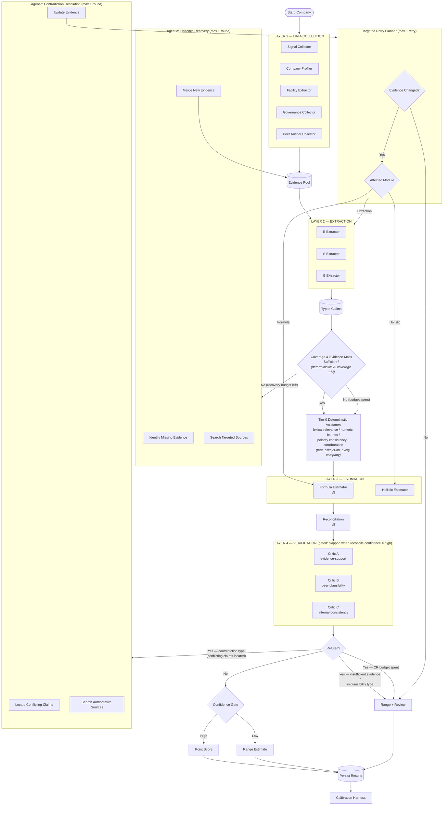

# Hybrid Agentic ESG Pipeline (v2)

## Objective

Enhance the existing deterministic ESG pipeline with **targeted agentic interventions** only where they improve evidence quality or resolve uncertainty.

The default execution path remains deterministic. Agentic modules are invoked only when predefined deterministic conditions are met.

---

# Design Principles

- Deterministic pipeline remains the primary execution path.
- Agentic reasoning is used only where deterministic conditions trigger it
  (see Success Criteria for honest, population-dependent invocation rates).
- Never rerun deterministic computations unless the underlying evidence changes.
- Every feedback loop has a fixed retry budget.
- Preserve explainability, reproducibility, and auditability.

---

# Changes vs the Original Target Architecture (AGENTIC_WORKFLOW.md)

Deliberate deviations from the original diagram, now made official:

- **Ratio Estimator: RETIRED.** It was never wired into any live path (dead
  code, confirmed by call-graph inspection), and its Tier-3 back-fill role is
  covered by the peer anchor inside the Formula Estimator. Removed from the
  flow rather than left as an aspirational box.
- **Peer-Analogy Estimator: folded into Formula.** The original 3-way Layer-3
  ensemble double-counted peer evidence (once as a formula contribution, once
  as a separate vote). The peer vote lives inside formula_estimator.py's
  contribution list (`peer_anchor.py`); Layer 3 is a 2-way ensemble.
- **Formula Estimator is v5** (aggregate saturation: normalized swing,
  coverage multiplier, evidence gate, sign-aware tanh) — see
  EQUATION_CHANGES.md CHANGES 5.0 and FORMULAS.md.
- **Reconciliation is v8** (evidence-mass trust: c_f = min(1, 0.4+0.04·M_trust))
  — see EQUATION_CHANGES.md CHANGES 8.0.
- **Verification is a hybrid two-tier layer** (deterministic Tier-0 validators
  always-on + gated LLM critic lenses), not three generic critics — see the
  Verification Layer Composition section below.

---

# Updated Pipeline



---

# Verification Layer Composition (Layer 4)

Layer 4 is a **hybrid two-tier design** (per the LLM-as-judge review in this
project's design discussions), not three generic LLM critics:

**Tier 0 — Deterministic validators.** Free, always-on, run for EVERY company
before estimation (see diagram node). No LLM calls:

- Lexical relevance: does a claim's cited signal text contain ANY topic
  vocabulary for its factor? (the deterministic "yoga page" catcher)
- Numeric bounds: claim values checked against physical/statistical reality
  (CORE_METRICS bands, Climate TRACE country totals, peer distributions).
- Polarity/direction consistency: a claim's sign vs its factor's registered
  direction; opposite-polarity same-factor conflicts flagged.
- Corroboration count: high-weight negative claims supported by exactly one
  source are flagged/capped.
- Known-failure-pattern rules: e.g. high confidence + DDG-fallback source +
  short excerpt → confidence capped (institutional memory of past incidents).

**Tier 1 — LLM critics, gated.** Run per-pillar ONLY when reconcile
confidence != 'high' (skipped when Formula and Holistic already agree
closely). Three distinct lenses, not three copies:

- **Critic A — evidence-support:** does the cited text actually assert what
  the claim says? Must quote the exact mismatch to refute.
- **Critic B — peer-plausibility:** is the final score arithmetically
  plausible vs the country baseline and real peer percentile?
- **Critic C — internal-consistency:** do Formula's evidence narrative and
  Holistic's reasoning contradict each other?

Majority (2-of-3) refutes; a critic whose call fails abstains. Full critic
mechanics, output schemas, and the synthetic bad-claim injection test are in
PHASE_4_PLAN.md — this document supersedes its ROUTING (the refute-type
split and the CR/Retry modules replace the simple bad-estimate handler) but
keeps its critic design and verification suite.

---

# Agentic Modules

## 1. Evidence Recovery

**Trigger**

- Coverage below threshold
- Evidence Mass below threshold
- Missing pillar coverage

**Purpose**

Acquire additional evidence before scoring.

**Workflow**

1. Identify missing information.
2. Select the most appropriate source.
3. Retrieve new evidence.
4. Merge into the Evidence Pool.
5. Resume extraction.

**Search Strategy — what makes recovery different from Layer 1**

Layer 1 already runs 15+ sources with targeted governance/facility queries.
Re-running the same searches finds the same nothing and burns the budget.
Recovery's value lives entirely in strategies Layer 1 did NOT exhaust:

- **Per-factor query reformulation** — search for the specific missing
  *factors* ("<company> workforce gender split", "<company> waste recycling
  program"), not generic company-level queries. The planner knows exactly
  which factors have no claims; each search targets one.
- **Name-variant expansion** — brand aliases, legal-entity names, parent/
  subsidiary variants (the Zara→Inditex lesson: the data existed under a
  different name). Try suffixed/unsuffixed and known-alias forms.
- **Local-language / home-country queries** — a Spanish SME's ESG coverage
  is likelier in Spanish regional press than in English indexes.
- **Deeper source-specific digs** — SEC full-text search (not just 10-K
  sections), national company registries, industry-association member lists.

If none of these strategies apply (all already tried, or no new angle
exists), recovery exits immediately without spending searches.

**Limits**

- Maximum one recovery round.
- Stop if no meaningful evidence is found.
- On exit (success or not), the QC gate is NOT re-entered as a loop — flow
  proceeds to estimation with whatever evidence now exists (budget spent).

---

## 2. Contradiction Resolution

**Trigger**

Verification critics detect conflicting evidence — **and only that**.
Not every refutation is a contradiction. The refute branch splits by type:

| Refutation type | Route |
|---|---|
| Contradiction (conflicting claims can be located) | → Contradiction Resolution |
| Insufficient evidence (nothing to resolve — retrying can't manufacture evidence) | → Range + Review directly |
| Peer-implausibility (score implausible vs peers, but no claim conflict) | → Range + Review directly |
| Any refutation after CR's one round is spent | → Range + Review directly |

This split mirrors PHASE_4_PLAN.md's specific-flagged-claim vs
insufficient-evidence routing: CR only runs when there is an actual conflict
it can act on. Sending an insufficient-evidence refutation to CR would spin
uselessly looking for conflicting claims that don't exist.

**Purpose**

Resolve contradictions using higher-authority sources.

**Workflow**

1. Identify conflicting claims.
2. Rank source authority.
3. Search authoritative sources.
4. Update evidence.
5. Resume pipeline.

**Source Priority**

```
Regulator
↓
Government
↓
Official Filing
↓
Company Disclosure
↓
Major News
↓
Other Sources
```

**Limits**

- Maximum one contradiction-resolution round.

---

## 3. Targeted Retry Planner

**Purpose**

Retry only the module responsible for failure.

Allowed retries:

- Extraction
- Formula
- Holistic

### Critical Rule

A retry is allowed **only if the Evidence Pool changed.**

- Formula is deterministic.
- Holistic should never be rerun on identical evidence.

Otherwise:

```
Emit Range + Needs Review
```

---

# Output States

| Condition | Output |
|-----------|--------|
| High confidence | Point Score |
| Low confidence | Range Estimate |
| Contradiction unresolved | Range + Needs Review |

---

# Retry Budget

| Module | Maximum |
|---------|---------|
| Evidence Recovery | 1 |
| Contradiction Resolution | 1 |
| Targeted Retry | 1 |

No recursive or unlimited loops.

---

# Logging Requirements

Every agent invocation should record:

- Trigger reason
- Actions performed
- Evidence added
- Coverage (before/after)
- Evidence Mass (before/after)
- Confidence (before/after)
- Runtime
- Retry count

---

# Success Criteria

- **Agentic invocation rate is population-dependent — set thresholds
  accordingly, not one global number.** Measured reality (this project's own
  calibration dumps): only ~7/30 bcorp companies had ANY real E or S claims —
  for small/private universes, thin evidence is the NORM, not an edge case.
  A single "≤10% invoke agents" target is only achievable for large/listed
  populations. Honest targets:
  - Large/listed companies: ≤10% invoke any agentic module.
  - Small/private universes: Evidence Recovery expected for 30–60%+; bound
    COST instead of rate — fixed per-company budget (1 round, capped
    searches) and a per-batch invocation cap so a thin batch degrades
    gracefully rather than stalling.
  - QC thresholds themselves are set empirically from dump data (start:
    trigger when a pillar has zero real claims), not chosen to hit a rate
    target.
- Runtime increase <20% on the large/listed population; bounded per-company
  worst case everywhere.
- Improved benchmark correlation (calibration harness — the standing gate:
  no pillar regresses).
- Reduced manual review rate.
- Improved confidence calibration.
- Full auditability retained.

---

# Build Status & Verdicts (2026-07-21)

This session ran a live evidence-recovery probe against the seed=314 backtest
sample (obscure B-Corp SMEs — "Copastur Turismo", "MW Enterprises LLC",
"Gravning GmbH", etc.) using the exact search strategies this doc's Evidence
Recovery section proposes (per-factor query reformulation, localized/Google
News routing). Result: DDG and Google News returned either nothing, or
confident WRONG-ENTITY text — a "gender pay / workplace safety" query for
Copastur Turismo returned a Hawaiian restaurant ("Lilikoi, Kauai's best new
Restaurant and Bar"); a Google News query for "MW Enterprises" returned an
unrelated person, "Melissa Wyatt". This reproduced the yoga-page failure
mode live, twice, and showed the bottleneck for this population is evidence
NOT EXISTING online, not retrieval quality. That finding drove the verdicts
below — build what improves precision (stop bad claims becoming evidence),
defer what bets on recall (finding/reconciling evidence that isn't there).

| Module | Verdict | Reason |
|---|---|---|
| QC gate (coverage/evidence-mass) | **BUILT** — `confidence_gate.qc_assess` | Deterministic read of values `saturate_pillar` already computes; observational only (Evidence Recovery deferred, so it never blocks — matches this doc's own "budget spent → proceed" branch) |
| Tier-0 deterministic validators | **BUILT** — `layer_2/claim_validators.py` | Directly attacks the proven failure mode above: lexical relevance (the yoga-page/Hawaiian-restaurant catcher), numeric bounds, polarity consistency, corroboration, known-failure shape (short cited text + high confidence — the exact shape both live failures had). Free, always-on, no LLM. |
| Confidence Gate (point vs range) | **BUILT** — `confidence_gate.gate` | Reconcile already computes `confidence`/`low`/`high` per pillar; nothing consumed them before this. Now routes low-confidence/thin-QC pillars to an honest range + `needs_review` instead of a forced point score. |
| Tier-1 gated LLM critics (A/B/C) | **BUILT** — `layer_4/critic_panel.py` + `layer_4/estimate_verifier.py` | Gated to the medium-confidence+QC-ok zone only (cost-refined beyond the original "confidence != high" trigger); bounded 1-retry/2-round loop; live-verified catching a real weak claim (an SBTi directory listing misread as a commitment) on production data. See PHASE_4_PLAN.md. |
| Evidence Recovery | **DEFERRED** | The probe (above) tested this module's own proposed strategies live and got wrong-entity garbage for the SME population. Not fluff outright — the *site-scoped* angle (SEC full-text, national registries) wasn't tested and may still be real — but broad keyword/localized reformulation is disproven for this population. Redesign around site-scoped sources only, and validate against web-visible/production-like companies, before building. |
| Contradiction Resolution | **DEFERRED** | Triggers only when two sources conflict — requires evidence abundance. Measured reality: 7/30 companies in a bcorp sample had ANY real claims. The dominant failure is zero evidence, not conflicting evidence — this module solves a problem the data rarely exhibits. Revisit if/when evidence volume increases (e.g. once scoring shifts to web-visible key-players rather than random bcorp SMEs). |
| Targeted Retry Planner | **DEFERRED** | Its own Critical Rule only allows a retry when the Evidence Pool changed — i.e. it has no independent value; it only ever fires after Evidence Recovery succeeds. Deferred alongside Recovery. |
| Phase 6 cutover (persistence + production wiring) | **BUILT** (2026-07-21) | `graph.py`'s ensemble path now persists to `company_metric_values` (source `agentic_ensemble_v1`, new low/high/confidence_label/verdict/needs_review columns — `db_migrations/005_ensemble_cutover.sql`), wires in metric-value estimation + explainability, and `api/v1/esg_data/routes.py` calls it directly. The old scoring_agent path is retained only for `calibration_harness.py --scorer llm` baselines. |

---

# Non-Goals

The system intentionally does **not** include:

- Master planning agent
- Dynamic workflow generation
- Recursive multi-agent conversations
- Unlimited retries
- Autonomous end-to-end orchestration

---

# Summary

The pipeline remains a **deterministic ESG scoring framework** augmented with **bounded, targeted agentic interventions**.

Agentic reasoning is limited to three scenarios:

1. Recover missing evidence.
2. Resolve contradictory evidence.
3. Retry only affected modules after evidence changes.

This preserves scalability, reproducibility, and explainability while improving robustness for difficult, low-evidence companies.